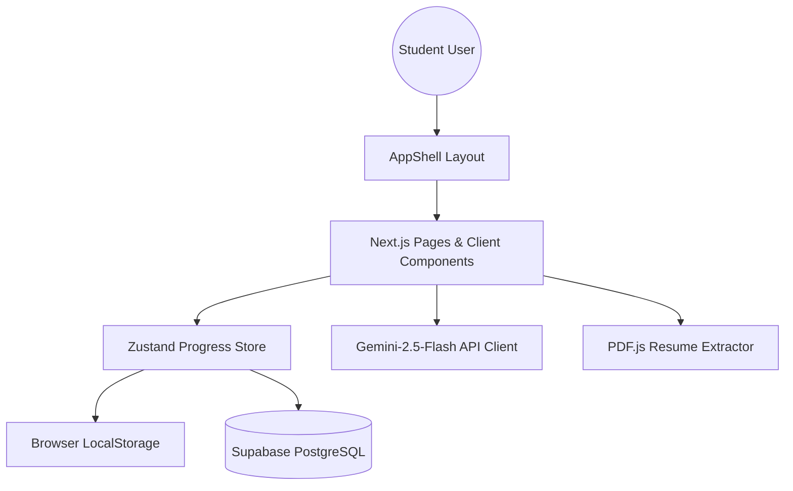

# Placement OS Tracker 🎯

A production-grade, commercially deployable full-stack placement preparation platform built for students to streamline their learning, practice, and readiness metrics.

[](https://nextjs.org/)
[](https://www.typescriptlang.org/)
[](https://tailwindcss.com/)
[](https://supabase.com/)
[](LICENSE)

---

## 🏗️ Architecture Overview

Placement OS Tracker is architected as an offline-first hybrid SaaS application. It features a rich client-side dashboard state machine backed by persistent state sync with Supabase and automated local fallback storage if credentials are not configured.

### Technical Stack
- **Frontend Core**: Next.js 16 (App Router), React 19, TypeScript
- **Styling**: Tailwind CSS v4 featuring sleek Linear/Vercel-inspired glassmorphism, responsive navigation grids, and custom dark/light modes
- **State Management**: Zustand v5 client-side state machine with persistent hydration and tick delta interval management
- **Database**: Supabase PostgreSQL database schema utilizing table-level custom username/password session persistence (bypassing expensive SMTP constraints for instant deployment)
- **Analytics**: Recharts engine mapping solved counts, cumulative study focus time, and weekly execution metrics
- **Parsing**: xlsx spreadsheet parsing pipeline converting 497+ raw DSA syllabus spreadsheet rows into structured JSON tables



---

## 📚 Comprehensive Features

### 1. DSA Tracker & Topic Canonicalization
- Contains **497+ DSA Problems** sourced directly from sheet imports.
- Problems are categorized into **17 predefined curriculum identifiers** (e.g., arrays, dynamic programming, graphs) utilizing a strict sync pipeline script `scripts/sync-sheets.ts` to enforce custom DAG unlock sequences.
- Supports difficulty filters, clickable platform links (LeetCode, NeetCode, Striver), bookmark tags, and revision flags.

### 2. Complete Gamification Engine
- **18 Achievements** categorized into distinct rarity tiers (Common, Rare, Epic, Legendary).
- Fully integrated XP scaling system where solved problems, planner completions, streaks, and interview mock completions yield proportional rewards.
- Implements real-time celebrations via an animated modal showcasing custom glows, rarity titles, descriptions, and confetti bursts.

### 3. Focus Mode Timer
- Relies on **delta-tracking architecture (`lastTickTime`)** to survive tab suspension, sleep states, browser refreshes, and OS sleep cycles.
- Features centered timer layouts with fixed widths to prevent screen stretching, dynamic question references, search filtering, and clean interval hook cleanups preventing memory leaks.

### 4. Mock Interview Simulator
- Simulates DSA, Frontend, Project Architecture, and STAR Behavioral HR rounds.
- Generates randomized questions (preventing repetition) with built-in 45-minute active timers, tabs for analyzing Brute-Force vs. Optimal complexity, and a dedicated "Generate New Mock" reset action.

### 5. HireLens ATS Resume Analyzer
- Fully native browser-side ATS scanner.
- Dynamically imports `pdfjs-dist` on the client (avoiding SSR build crashes) to extract raw text from PDF resume uploads.
- Matches key terms against **32 industry roles**, recommends the top 3 best fits, flags missing skills, and highlights matching text on-screen.

---

## ⚡ Quick Start & Environment Configuration

### Prerequisites
- Node.js version `>= 18`
- npm or yarn package manager

### 1. Run Setup Script
Placement OS features an automated setup script that verifies your environment, ensures all packages are installed, and auto-generates your environment variables if they are missing.

```bash
npm run setup
```

This will automatically create a `.env.local` file in your root folder:
```env
NEXT_PUBLIC_SUPABASE_URL=
NEXT_PUBLIC_SUPABASE_ANON_KEY=
```

*Note: If these values are left empty, the application will automatically fall back to **Guest Mode**, allowing all features to run using local browser storage.*

---

## 🛢️ Supabase Database Setup

To hook the platform up to a persistent PostgreSQL database:

1. Create a free project at [Supabase](https://supabase.com).
2. Grab the project URL and API Anon Key from **Project Settings → API** and paste them into your `.env.local` file.
3. Open the **SQL Editor** in the Supabase Dashboard.
4. Copy the contents of [supabase-schema-custom-auth.sql](file:///c:/Users/AASHISH/OneDrive/Desktop/placement-os/placement-os/supabase-schema-custom-auth.sql) from the project root.
5. Paste the schema contents in the SQL Editor and click **Run**.

This SQL script creates the necessary database schemas, RLS tables, and index structures (`app_users`, `user_progress`, `user_solved_problems`, `user_bookmarks`, `user_revisions`, `user_weekly_planner`, and `custom_roadmaps`).

---

## 🛠️ Build & Deployment

### Local Development
To launch the hot-reloading development server:
```bash
npm run dev
```

### Production Build
To check TypeScript compile integrity and generate the optimized Vercel-ready distribution bundle:
```bash
npm run build
```
Start the production server:
```bash
npm run start
```

### Deploying to Vercel
1. Push your code repository to GitHub.
2. Link the repository to your Vercel Dashboard.
3. Configure `NEXT_PUBLIC_SUPABASE_URL` and `NEXT_PUBLIC_SUPABASE_ANON_KEY` inside Vercel's Environment Variables panel.
4. Click **Deploy**. Vercel will trigger the production build script and serve the application globally.

---

## ❓ Troubleshooting

#### 1. "Can't resolve 'canvas' in pdfjs-dist"
This build error occurs when Next.js/Turbopack attempts to resolve server-side node canvas rendering inside `pdfjs-dist` bundles. We resolve this by configuring a fallback resolve alias inside [next.config.ts](file:///c:/Users/AASHISH/OneDrive/Desktop/placement-os/placement-os/next.config.ts) pointing native dependencies to [empty.ts](file:///c:/Users/AASHISH/OneDrive/Desktop/placement-os/placement-os/src/lib/empty.ts).

#### 2. "Duplicate React keys warning"
We updated loop templates such as `src/app/planner/weekly/page.tsx` from raw iteration index mappings to custom structured keys like `key={`${w.week}-${w.focus}-${index}`}`.

#### 3. "Gemini API returns errors"
Go to the **Settings** page inside Placement OS and save a valid Gemini API token from [Google AI Studio](https://aistudio.google.com/). The key is stored locally in your browser context.
